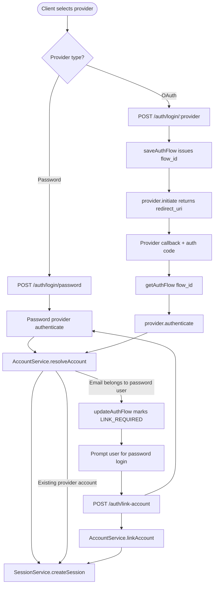
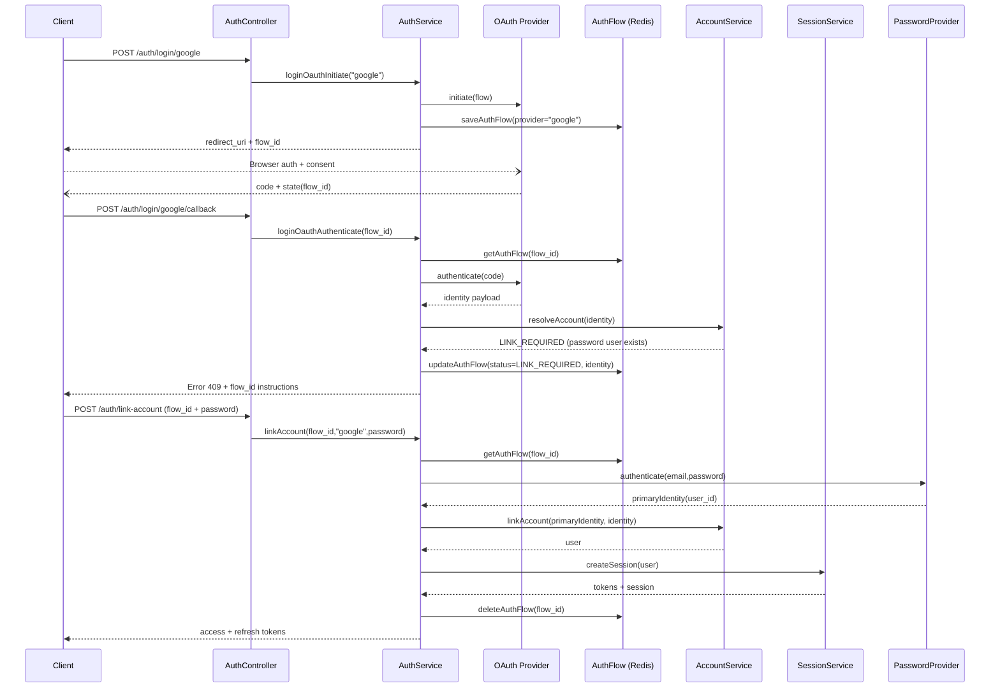

# Identity Service (Auth_2)

Identity and access management service that centralizes user onboarding, credential storage, and session/token orchestration for downstream applications.

## Highlights
- Fastify HTTP API with modular routing (`src/routes`) and controller/service layers.
- Dual persistence: PostgreSQL via Knex migrations plus MongoDB models, selectable per module.
- Redis-backed cache/service abstractions for session + OAuth flows.
- Provider-oriented auth layer (`providers.services/`) enabling local password and federated OAuth.
- Type-safe validation with Zod schemas and shared domain types under `src/type`.

## Project Layout
```
identityService/
├─ src/
│  ├─ controller/        # Fastify route handlers
│  ├─ service/           # User/account/auth logic
│  ├─ core/db/           # Knex + Mongoose connectors, migrations, schemas
│  ├─ core/redis/        # Cache registry and services
│  ├─ routes/            # HTTP route definitions
│  ├─ utils/             # Error helpers, async wrapper, OAuth extractor
│  └─ config/            # Constants, container wiring
├─ docs/                 # Flow diagrams + migration notes
├─ env.ts                # Environment variable loader
├─ knexfile.ts           # Knex configuration entrypoint
└─ tsconfig.json         # TypeScript compiler settings
```

## Getting Started
1. **Install dependencies**
   ```bash
   npm install
   ```
2. **Configure environment**
   - Duplicate `env.ts` or follow the variables it expects (database URLs, Redis, JWT secrets, OAuth keys).
   - Ensure both PostgreSQL and MongoDB instances are reachable if you plan to exercise all modules.
3. **Run database migrations** (PostgreSQL)
   ```bash
   npm run knex -- migrate:latest
   ```
4. **Start development server**
   ```bash
   npm run dev
   ```
   Production build uses `npm run build` + `npm start`.

## NPM Scripts
| Script | Purpose |
| --- | --- |
| `npm run dev` | Watch-mode Fastify server via `tsx` |
| `npm run build` | Compile TypeScript to `dist/` |
| `npm start` | Run compiled server (`dist/index.js`) |
| `npm run knex -- <cmd>` | Execute Knex CLI commands (migrate, seed, etc.) |

## Additional References
- `docs/flow.md` – narrative flow of auth + token lifecycle.
- `docs/migrations.md` – notes on schema evolution and relationships.
- `src/service/auth` – pluggable provider implementation details.

## Auth Flow Visuals

### Provider Selection & Account Linking
The Mermaid flowchart has a logical issue with the flow after the password verification step. Here's what's wrong:

**Problem:** After `LinkEndpoint --> PasswordProvider`, the flow goes to `AccountLinker`, but it never verifies whether the password authentication was successful or not. There's no conditional branch to handle authentication failure.

**Issues:**

1. **Missing authentication result handling**: `PasswordProvider` should have a success/failure branch before proceeding to `AccountLinker`
2. **Unconditional linking**: The flow assumes password authentication always succeeds, which isn't realistic

**Suggested fix:**


The key change is adding a decision node after the password verification to handle both success and failure cases.

### Sequence: OAuth Login Followed By Password Linking


Keep tests and lint steps wired into the scripts block once the suite is available. For questions or expansion ideas, check `docs/flow.md` and align new modules with the container setup in `src/app/container.ts`.
