**Flowcharts are composed of nodes (geometric shapes) and edges (arrows or lines). The Mermaid code defines how nodes and edges are made and accommodates different arrow types, multi-directional arrows, and any linking to and from subgraphs.**

### NODE
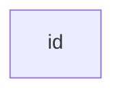

> Instead of flowchart one can also use graph.

### A NODE WITH TEXT 
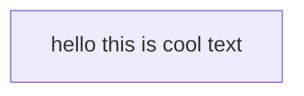

### use *"* to enclose the unicode text
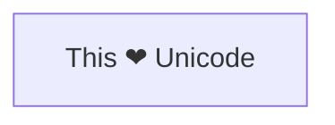

### Markdown formating
> Use double quotes and backticks "` text `" to enclose the markdown text.
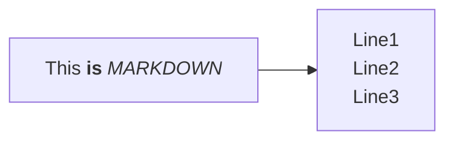

### direction
> LR-> left to right TD -> top to down
- LR -> **LEFT_TO_RIGHT**
- TB -> **TOP_TO_BOTTOM**
- TD
- RL
- DT
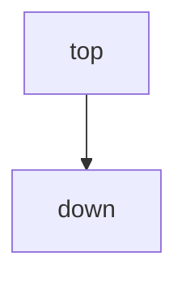

### NODE SHAPE
    > A node with round edge shape
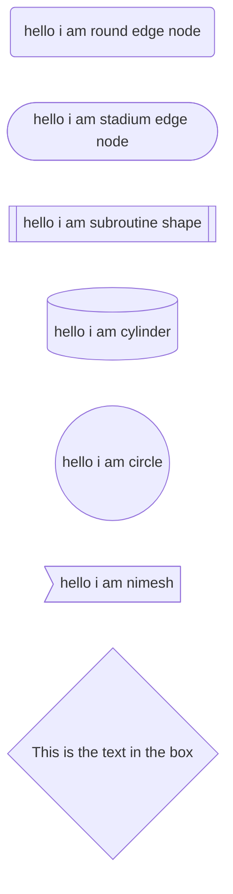

## EXPANDED NODEJS SHAPE
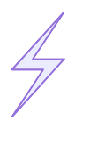
---

*You can use the icon shape to include an icon in your flowchart. To use icons, you need to register the icon pack first. Follow the instructions to add custom icons. The syntax for defining an icon shape is as follows:*

###ICON SHAPE
```mermaid
    graph TD
        A@{ shape: "fa:user", form: "square", label: "User Icon", pos: "t" ,h:60} 
```

> we can use image also
```mermaid
    graph TD
        A@{ img: "https://picsum.photos/id/237/200/300", label: "this is image", pos: "t", w:60, constraint: "off" }
```

### link between nodes
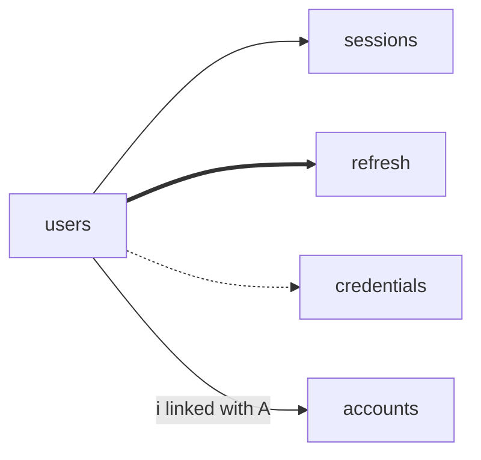


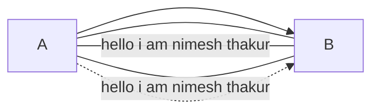

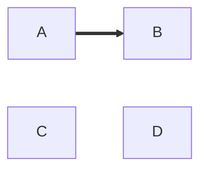

### Chaining Of Node;
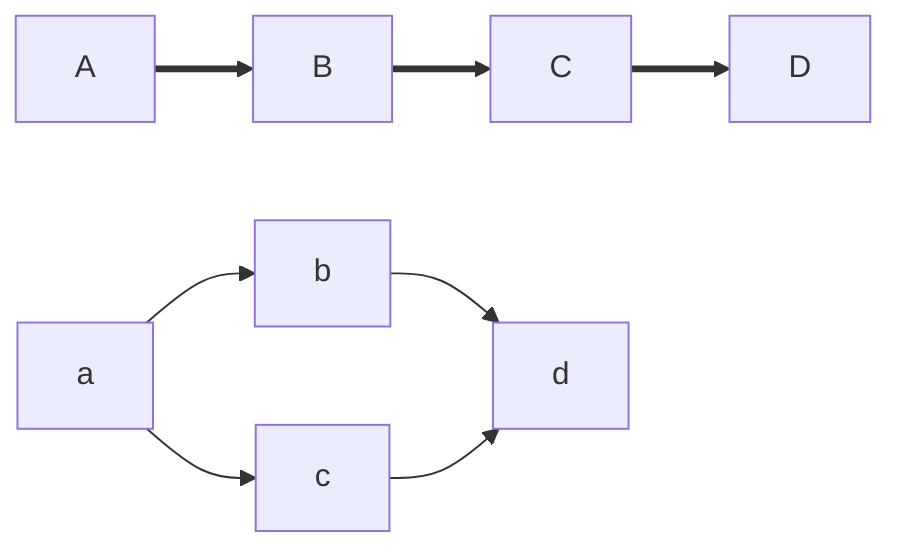

### lagom;
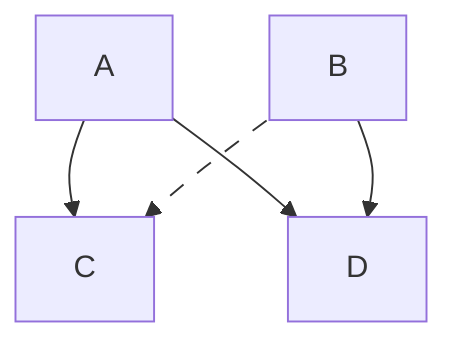
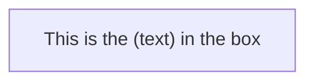

### subgraph
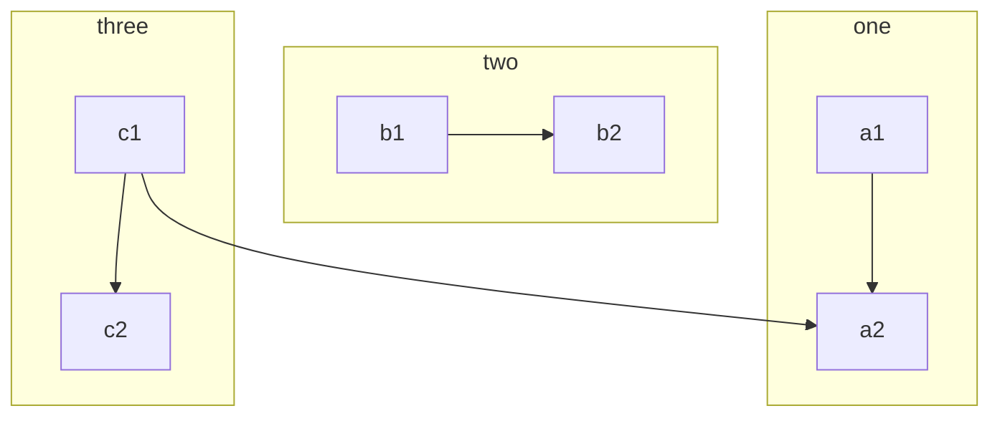

### subgraph and direction
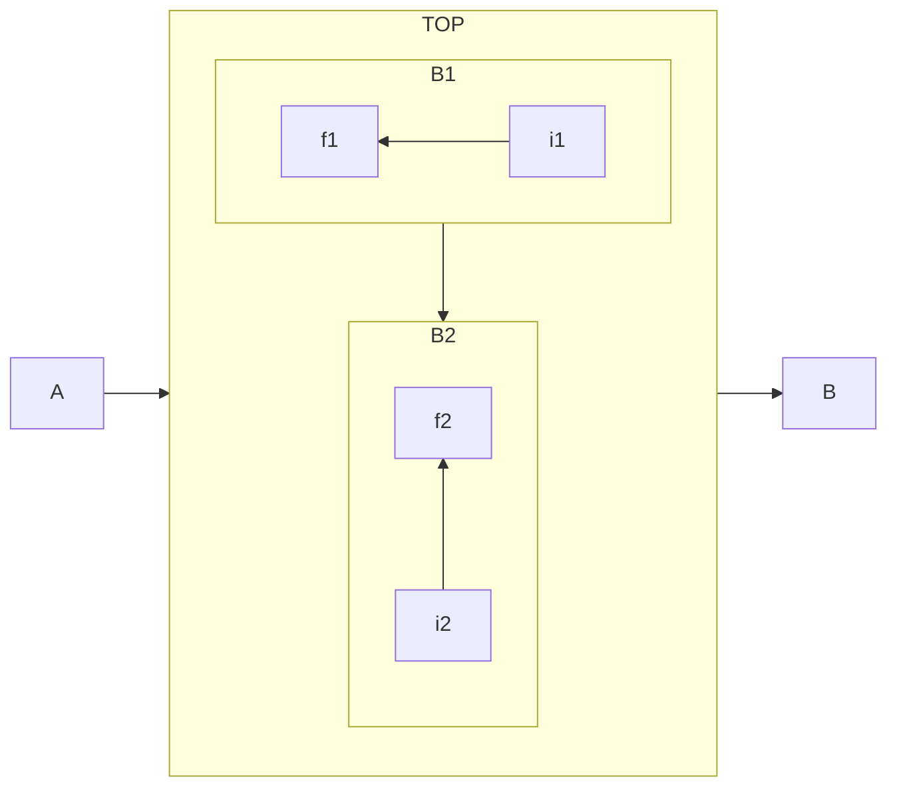


### mardown string
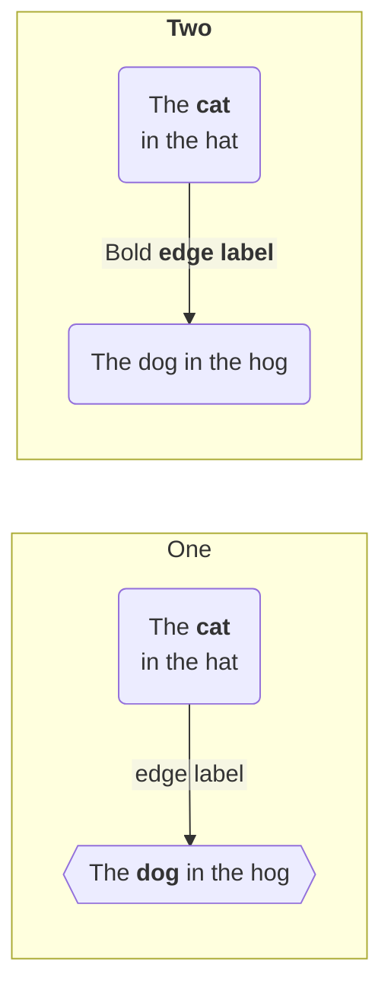


