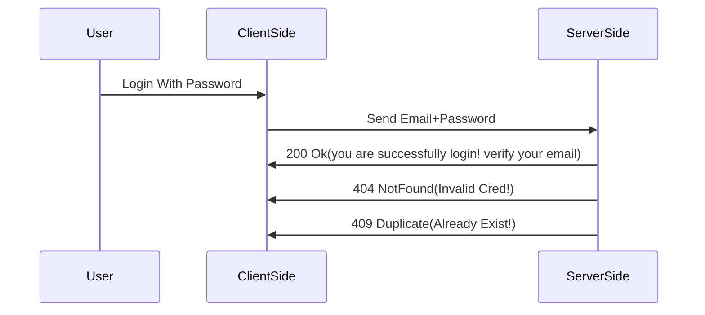
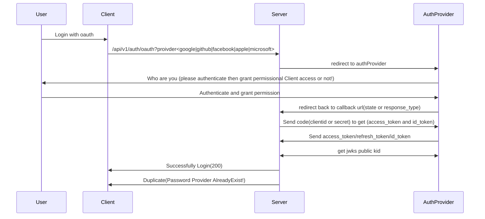

# Login With Password

```mermaid
    sequenceDiagram
        User->>ClientSide:Login With Password
        ClientSide->>ServerSide:Send Email+Password
        ServerSide->>ClientSide:200 Ok(you are successfully login! verify your email)
        ServerSide->>ClientSide:404 NotFound(Invalid Cred!)    
        ServerSide->>ClientSide:409 Duplicate(Already Exist!)
```

# Login With Oauth

```mermaid
    sequenceDiagram
        User->>Client:Login with oauth
        Client->>Server:/api/v1/auth/oauth?proivder<google|github|facebook|apple|microsoft>
        Server->>AuthProvider:redirect to authProvider
        AuthProvider->>User:Who are you (please authenticate then grant permissional Client access or not!)
        User->>AuthProvider:Authenticate and grant permission
        AuthProvider->>Server:redirect back to callback url(state or response_type)
        Server->>AuthProvider:Send code(clientid or secret) to get (access_token and id_token)
        AuthProvider->>Server:Send access_token/refresh_token/id_token
        Server<<->>AuthProvider:get jwks public kid
        Server->>Client:Successfully Login(200)
        Server->>Client:Duplicate(Password Provider AlreadyExist!)
```

